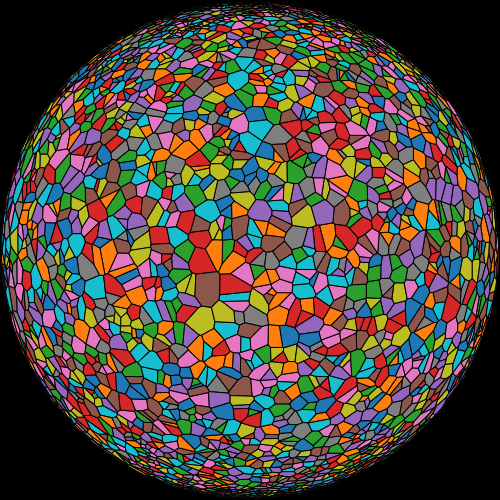

# [Rust D3 geo voronoi](<https://github.com/martinfrances107/rust_d3_geo_voronoi>)

( rust 2021 edition.)

This is a port of the [d3-geo-voronoi](<https://github.com/Fil/d3-geo-voronoi>) library into a [RUST](<https://www.rust-lang.org/>) library.

 As a example the library can be used to compute the following delaunay mesh.

( computed from 6,000 points on a sphere selected at random )

Currently we have 82% test coverage ( as reported by cargo tarpaulin -o Html )

## Performance Profiling.

### Demo Page
The original javascript library has a benchmark in the form of web page which records the number of frames displayed per second.
( d3-geo_voronoi/src/benchmark/sphereCanvas.html)
For comparison the bencmark has been ported
( rust_d3_geo_vornoi/benchmark )

The result show only a minor 5-10% improvement in performance.

### Profile Target
This workspace contain a binary "profie_target" which outputs the result of a computation similar to that of the demo_page.
Before API finialization - I am currently  using cargo flamegraph to identify any obvious optimizations.

## Further Development.

To be ported:-

contour.js and geo-contour-test.js
geo_voronoi_test "geoVoronoi.hull does not break on difficult polygons"

## Instructions
It used [wasm pack](<https://github.com/rustwasm/wasm-pack>) to package the following packages into a single wasm file. [rust_d3_geo](<https://github.com/martinfrances107/rust_d3_geo>), [rust_d3_delaunay](<https://github.com/martinfrances107/rust_d3_delaunay>). From this,  a simple demo application constructed.
The application displays a delaunay mesh of a large number of cells onto a sphere.

* To build and start the web server:-

        cd benchmark
        npm install
        npm run start

the last command automatically start you web browser.

 

## Module Dependencies

* [`delaunator`]("https://github.com/mourner/delaunator-rs.git") for generation of the delaunay mesh.

* [`rust_d3_array`]("https://github.com/martinfrances107/rust_d3_array.git") for a common set of helpers.

* [`rust_d3_delaunay`]("https://github.com/martinfrances107/rust_d3_delaunay.git")

* [`rust_d3_geo`]("https://github.com/martinfrances107/rust_d3_geo.git")
